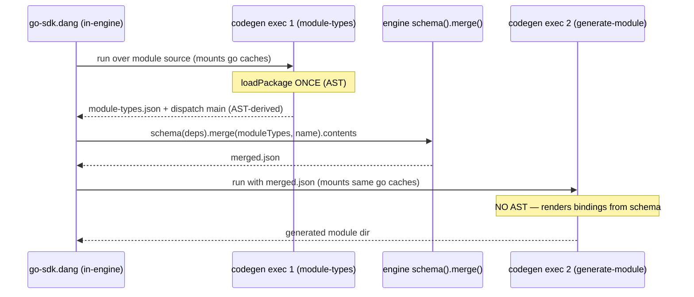

# Phase 1 — Go module codegen in `dagger/go-sdk` — Implementation Plan

> **For agentic workers:** REQUIRED SUB-SKILL: Use superpowers:subagent-driven-development (recommended) or superpowers:executing-plans to implement this plan task-by-task. Steps use checkbox (`- [ ]`) syntax for tracking.

**Goal:** Give `dagger/go-sdk` its own engine-free Go *module* codegen in `helpers/codegen`, and wire the dang `generate` surface to it — the symmetric completion of PR #15, which did this for *clients*.

**Architecture:** Mirror the client extraction exactly. Bring the module-generation Go files from `dagger/dagger:cmd/codegen/generator/go` into `helpers/codegen/generator/gogenerator` (package `go` → `gogenerator`, import `github.com/dagger/dagger/cmd/codegen/...` → `codegen/...`), strip engine/telemetry deps, and re-widen the shared generator internals the client extraction narrowed. Add a `generate-module` subcommand to the `codegen` binary. The one genuine engine operation — merging the module's own AST-derived types into the schema — is done by the **dang** layer via the engine's canonical `dag.schema(deps).merge(moduleTypes, name).contents` (a v1.0.0-0 core API field the SDK-as-module surface already depends on), so the binary stays engine-free.

**Tech Stack:** Go 1.25 (matches `codegenBuilder`'s `golang:1.25-alpine`), `golang.org/x/tools/go/packages` (AST load), `github.com/dave/jennifer/jen` (module main codegen), `text/template` + embedded `.tmpl`, dang (`go-sdk.dang`), the `helpers/codegen` `flag`-based CLI.

## Global Constraints

- Package name for all ported generator files: `gogenerator` (not `go`). Copied verbatim from PR #15's rename. — verify at `helpers/codegen/generator/gogenerator/*.go`.
- Import rewrite for every ported file: `github.com/dagger/dagger/cmd/codegen/generator` → `codegen/generator`; `.../cmd/codegen/generator/go/templates` → `codegen/generator/gogenerator/templates`; `.../cmd/codegen/introspection` → `codegen/introspection`.
- The binary MUST remain engine-free: no `dagger.io/dagger` import, no `dagger.Connect`, no nested engine session. The schema merge lives in dang. (This is the property PR #15 established; do not regress it.)
- Do NOT break the client path. `GenerateClient` and its tests (`generate_client_test.go`, the `templates/*_test.go` golden tests) must stay green after every task.
- Strip `cmd/codegen/trace` + `telemetry "github.com/dagger/otel-go"` spans from every ported file (replace `trace.Tracer().Start(...)`/`telemetry.EndWithCause` with plain calls / removal) — same transform PR #15 applied.
- Do NOT port `mount.go` (`MountedFS` is dead code, zero references, and holds the only `github.com/dagger/dagger/internal/fsutil` engine-internal import in the set).
- go.mod deps to add to `helpers/codegen/go.mod`: `github.com/dave/jennifer`, `github.com/dschmidt/go-layerfs`, `golang.org/x/tools` (packages), `github.com/mitchellh/mapstructure`, `golang.org/x/mod` (already present via client), `github.com/vektah/gqlparser/v2` (only if a Go-side merge is chosen — see Task 8 alt). Flag any dep addition in the commit body.
- Commits: stg patches, `Signed-off-by: Yves Brissaud <yves@dagger.io>`, no AI attribution anywhere.
- Reference (read-only) source tree for the port: `dagger/dagger@main` `cmd/codegen/generator/go/` — re-verify `file:line` before copying; it moves.

## File Structure

New files in `helpers/codegen/generator/gogenerator/`:
- `generate_module.go` — `GenerateModule(ctx, schema, schemaVersion)` entry (ported, engine-merge removed).
- `generate_library.go` — `GenerateLibrary(...)` (ported).
- `generate_entrypoint.go` — Go "not implemented" stub (ported, or inlined into main.go).
- `loader.go` — `loadPackage` via `go/packages`; `PackageInfo` gains `DaggerPkgReplaced` (reconciled — see Task 3).
- `generate_module_test.go` — `syncModReplaceAndTidy` unit test (ported).
- `templates/module_types.go`, `module_enums.go`, `module_objects.go`, `module_interfaces.go`, `module_funcs.go`, `modules.go`, `introspect_emit.go`, `visit.go`, `optional.go` — pure `go/types`/`jennifer` AST rendering (ported).
- `templates/src/_dagger.gen.go/module.go.tmpl`, `templates/src/internal/dagger/dagger.gen.go.tmpl` — embedded templates (copied).
- Corresponding `*_test.go` for the module templates (`module_objects_test.go`, `module_interfaces_test.go`, `modules_test.go`, `introspect_emit_test.go`, `visit_determinism_test.go`, `interface_surface_test.go`) — ported.

Modified files:
- `helpers/codegen/generator/gogenerator/generator.go` — re-widen `generateCode`; re-add `PackageInfo.DaggerPkgReplaced`; re-add `StarterTemplateFile`/`internalDaggerDir` consts.
- `helpers/codegen/generator/gogenerator/templates/functions.go` — re-add `ctx/modulePkg/moduleFset/pass` to `goTemplateFuncs`, the `GoTemplateFuncsForModule` constructor, the `ModuleIntrospectionEmitter` interface + `NewModuleIntrospectionEmitter`, and the module FuncMap entries (`IsPartial`, `ModuleMainSrc`, `Dependencies`, `HasLocalDependencies`).
- `helpers/codegen/generator/config.go` — add `ModuleGeneratorConfig.{IsInit, LibVersion}`; keep the existing `ModuleName/ModuleSourcePath/ModuleParentPath`.
- `helpers/codegen/main.go` — add `generate-module` mode (flags: `--module-source-path`, `--module-name`, `--module-parent-path`, `--is-init`, `--lib-version`; reuse `--introspection-json-path`, `--output`).
- `go-sdk.dang` — add `moduleDirectory` (mirrors `clientDirectory`) doing the AST-emit → engine-merge → render dance; repoint `generate`/`mod.dang generate` at it.
- `.dagger/modules/e2e/main.dang` — extend `generateModuleCheck`/`generateCheck` to assert the helper path (and add a module-compiles check mirroring `clientCompilesCheck`).

## Self-merge & AST-parse design

The one engine operation in module-gen is the self-type schema merge. Decision: **dang performs it** via the engine's canonical `dag.schema(deps).merge(moduleTypes, name).contents` (option c), so the codegen binary stays engine-free and the merge keeps a single reference in the engine (not duplicated in Go). This means the binary is invoked twice around one dang merge.

**Two binary calls ≠ two AST parses.** The parsed Go package (`modulePkg`/`moduleFset`) is consumed by exactly two things: `ModuleIntrospectionJSON` (the emit) and `moduleMainSrc` (the module `invoke()` dispatch main). Verified: `moduleMainSrc` reads **no** `funcs.schema`/`fullSchema` — it walks `modulePkg.Types.Scope()` only, so the dispatch main is schema-independent. Every other output (core bindings, `<module>.gen.go`, `dag/`) renders from the introspection schema + config flags, with no AST. So the split is:



One `packages.Load` total. If, during implementation, a binding `.tmpl` turns out to reach `ModuleMainSrc`/`modulePkg` (grep `src/` for `ModuleMainSrc`), move that one file into exec 1's render set — the seam stays "AST-dependent files in exec 1, schema-driven files in exec 2."

**If the split proves entangled with the bootstrap "partial"/`NeedRegenerate` passes** (`GenerateModule` already re-invokes for a fresh module with no `dagger.gen.go` yet), the fallback is a plain double parse: exec 1 = `loadPackage` + emit; exec 2 = `loadPackage` + full render. Its cost is small and bounded — `loadPackage` strips function bodies before type-checking, and both execs share the warm `go-build`/`go-mod` cache volumes, so exec 2 re-type-checks only the user's own (small) module against cached dependency export data (the expensive `dagger.io/dagger` type-check is populated once by exec 1 and reused). Typical marginal cost: tens of ms, not a second full load. The single-parse split is preferred; this is the acceptable floor.

---

### Task 1: Re-widen the shared generator internals (backward-compatible, no module code yet)

Re-introduce the module-generation plumbing the client extraction removed, without changing client behavior. After this task the client path is byte-for-byte equivalent (module params are nil/unused) and the codebase is ready to host module templates.

**Files:**
- Modify: `helpers/codegen/generator/gogenerator/templates/functions.go`
- Modify: `helpers/codegen/generator/gogenerator/generator.go`
- Test: `helpers/codegen/generator/gogenerator/templates/functions_module_test.go` (new)

**Interfaces:**
- Produces:
  - `func GoTemplateFuncsForModule(ctx context.Context, schema, fullSchema *introspection.Schema, schemaVersion string, cfg generator.Config, pkg *packages.Package, fset *token.FileSet, pass int) template.FuncMap`
  - `type ModuleIntrospectionEmitter interface { ModuleIntrospectionJSON(moduleName string) ([]byte, error) }`
  - `func NewModuleIntrospectionEmitter(ctx, schema, schemaVersion, cfg, pkg, fset) ModuleIntrospectionEmitter`
  - `generateCode(ctx, cfg, schema, schemaVersion, mfs, pkgInfo, mod *moduleGenCtx) error` where `moduleGenCtx` bundles `{pkg *packages.Package; fset *token.FileSet; pass int}`; `nil` = client mode.
  - `PackageInfo{ PackageName, PackageImport string; DaggerPkgReplaced bool }`

- [ ] **Step 1: Write the failing test** — `functions_module_test.go`

```go
package templates

import (
	"context"
	"testing"

	"github.com/stretchr/testify/require"

	"codegen/generator"
	"codegen/introspection"
)

func TestGoTemplateFuncsForModuleHasModuleEntries(t *testing.T) {
	schema := &introspection.Schema{}
	fm := GoTemplateFuncsForModule(context.Background(), schema, schema, "v0.12.0", generator.Config{}, nil, nil, 1)
	for _, name := range []string{"IsPartial", "ModuleMainSrc", "Dependencies", "HasLocalDependencies", "IsModuleCode"} {
		require.Contains(t, fm, name, "module FuncMap must expose %s", name)
	}
}

func TestGoTemplateFuncsClientUnchanged(t *testing.T) {
	schema := &introspection.Schema{}
	fm := GoTemplateFuncs(schema, schema, "v0.12.0", generator.Config{})
	require.Contains(t, fm, "BoundModule")
	require.NotContains(t, fm, "ModuleMainSrc", "client FuncMap must not gain module-only entries")
}
```

- [ ] **Step 2: Run test to verify it fails**

Run: `cd helpers/codegen && go test ./generator/gogenerator/templates/ -run TestGoTemplateFuncsForModule -v`
Expected: FAIL — `GoTemplateFuncsForModule` undefined.

- [ ] **Step 3: Widen `goTemplateFuncs` and add the module constructor**

In `templates/functions.go`, re-add to the `goTemplateFuncs` struct the fields the extraction removed (from the PR #15 diff): `ctx context.Context`, `modulePkg *packages.Package`, `moduleFset *token.FileSet`, `pass int`. Re-add imports `context`, `golang.org/x/tools/go/packages`. Keep the existing client fields. Then add, without touching the existing `GoTemplateFuncs` (client) constructor:

```go
// GoTemplateFuncsForModule builds the FuncMap for module generation, which
// needs the loaded module package/fileset and pass index the client path omits.
func GoTemplateFuncsForModule(
	ctx context.Context,
	schema *introspection.Schema,
	fullSchema *introspection.Schema,
	schemaVersion string,
	cfg generator.Config,
	pkg *packages.Package,
	fset *token.FileSet,
	pass int,
) template.FuncMap {
	if fullSchema == nil {
		fullSchema = schema
	}
	return goTemplateFuncs{
		CommonFunctions: generator.NewCommonFunctions(schemaVersion, &FormatTypeFunc{}),
		ctx:             ctx,
		cfg:             cfg,
		modulePkg:       pkg,
		moduleFset:      fset,
		schema:          schema,
		fullSchema:      fullSchema,
		schemaVersion:   schemaVersion,
		pass:            pass,
	}.FuncMap()
}
```

Restore `ModuleIntrospectionEmitter` + `NewModuleIntrospectionEmitter` verbatim from the source (`cmd/codegen/generator/go/templates/functions.go`), rewriting imports per the Global Constraints.

In `FuncMap()`, re-add the module entries the diff shows were removed, next to the existing ones: `"IsPartial": funcs.isPartial`, `"ModuleMainSrc": funcs.moduleMainSrc`, `"Dependencies": funcs.Dependencies`, `"HasLocalDependencies": funcs.HasLocalDependencies`. Restore the `isPartial` method. `moduleMainSrc`/`Dependencies`/`HasLocalDependencies` land with Task 5's `modules.go` — until then, stub them as methods that `panic("module templates not yet ported")` so the package compiles and only module templates (absent) would hit them. (Client templates never call these — verified against the removed FuncMap set.)

- [ ] **Step 4: Widen `generateCode` (nil = client)** — in `generator.go`

Change the signature to add a trailing `mod *moduleGenCtx` and thread `ctx/pkg/fset/pass` into the template-func construction, selecting the constructor by mode:

```go
type moduleGenCtx struct {
	pkg  *packages.Package
	fset *token.FileSet
	pass int
}

func generateCode(
	ctx context.Context,
	cfg generator.Config,
	schema *introspection.Schema,
	schemaVersion string,
	mfs *memfs.FS,
	pkgInfo *PackageInfo,
	mod *moduleGenCtx, // nil => client
) error {
	newFuncs := func(s, full *introspection.Schema) template.FuncMap {
		if mod == nil {
			return templates.GoTemplateFuncs(s, full, schemaVersion, cfg)
		}
		return templates.GoTemplateFuncsForModule(ctx, s, full, schemaVersion, cfg, mod.pkg, mod.fset, mod.pass)
	}
	coreFuncs := newFuncs(coreSchema, schema)
	fullFuncs := newFuncs(schema, schema)
	// ... rest unchanged ...
}
```

Update the sole existing caller `GenerateClient` (`generate_client.go:60`) to pass `nil`. Re-add `PackageInfo.DaggerPkgReplaced bool` and the `StarterTemplateFile`/`internalDaggerDir` consts removed by the extraction (module templates reference them).

- [ ] **Step 5: Run tests to verify pass**

Run: `cd helpers/codegen && go build ./... && go test ./generator/gogenerator/... -v`
Expected: PASS (new module test + all existing client/golden tests).

- [ ] **Step 6: Commit**

```bash
git add helpers/codegen/generator/gogenerator/templates/functions.go \
        helpers/codegen/generator/gogenerator/templates/functions_module_test.go \
        helpers/codegen/generator/gogenerator/generator.go \
        helpers/codegen/generator/gogenerator/generate_client.go
stg new -m "codegen: re-widen generator internals for module generation

Backward-compatible: client path passes a nil module context and is
unchanged. Re-adds the pkg/fset/pass plumbing and module FuncMap entries
the client extraction (PR #15) narrowed, ahead of porting the module
templates.

Signed-off-by: Yves Brissaud <yves@dagger.io>"
stg refresh
```

---

### Task 2: Add `go/packages` module loader

**Files:**
- Create: `helpers/codegen/generator/gogenerator/loader.go`
- Modify: `helpers/codegen/go.mod` (add `golang.org/x/tools`)

**Interfaces:**
- Consumes: `PackageInfo` (Task 1).
- Produces: `func loadPackage(ctx context.Context, dir string) (*packages.Package, *token.FileSet, error)` and any `PackageInfo`-building helper the source `loader.go` exposes (e.g. `getPackageInfo`). Re-verify exact names in source.

- [ ] **Step 1** — Port `cmd/codegen/generator/go/loader.go` verbatim, then apply: import rewrites (Global Constraints); **remove** the `cmd/codegen/trace` span and `otel-go` usage (wrap the body without the span); reconcile `PackageInfo` — the source declares `PackageInfo` (with `DaggerPkgReplaced`) *here*, but the dest already declares it in `generator.go` (Task 1 added the field). Delete the duplicate declaration from the ported `loader.go`; keep the dest's single `PackageInfo` in `generator.go`.
- [ ] **Step 2** — `cd helpers/codegen && go get golang.org/x/tools/go/packages && go build ./...`. Expected: compiles.
- [ ] **Step 3** — Port `generate_module_test.go`'s `syncModReplaceAndTidy` unit test now (it only needs `modfile`); it will fail to compile until Task 4 adds `syncModReplaceAndTidy`. If executing strictly green-per-task, defer this test file to Task 4 and note it here. Run: `go build ./...`. Expected: PASS.
- [ ] **Step 4: Commit**

```bash
stg new -m "codegen: port the go/packages module loader

Engine-free: loads the user module's Go source via go/packages, needs a
Go toolchain but no engine. Trace span dropped as in the client port.

Signed-off-by: Yves Brissaud <yves@dagger.io>"
git add -A helpers/codegen/generator/gogenerator/loader.go helpers/codegen/go.mod helpers/codegen/go.sum
stg refresh
```

---

### Task 3: Port the pure-AST module template files

**Files:**
- Create: `templates/visit.go`, `optional.go`, `module_types.go`, `module_enums.go`, `module_objects.go`, `module_interfaces.go`, `module_funcs.go`, `modules.go`, `introspect_emit.go` under `helpers/codegen/generator/gogenerator/templates/`.
- Create: `templates/src/_dagger.gen.go/module.go.tmpl`, `templates/src/internal/dagger/dagger.gen.go.tmpl`.
- Modify: `helpers/codegen/go.mod` (add `github.com/dave/jennifer`, `github.com/mitchellh/mapstructure`).
- Test: port `module_objects_test.go`, `module_interfaces_test.go`, `modules_test.go`, `introspect_emit_test.go`, `visit_determinism_test.go`, `interface_surface_test.go`.

**Interfaces:**
- Consumes: the widened `goTemplateFuncs` fields (Task 1), `loadPackage` (Task 2).
- Produces: methods `moduleMainSrc`, `Dependencies`, `HasLocalDependencies`, `isModuleCode`, `moduleRelPath` on `goTemplateFuncs` (replacing Task 1's panics); `NewModuleIntrospectionEmitter`'s backing `ModuleIntrospectionJSON`.

- [ ] **Step 1** — Copy each file verbatim from `cmd/codegen/generator/go/templates/`, apply import rewrites, drop the `telemetry`/`trace` references in `modules.go` (note: its `telemetry.InitEmbedded/Close` occurrences inside generated-code *string literals* are NOT Go imports — leave those strings intact; only remove any real `otel-go`/`trace` Go import). Remove the Task 1 panic stubs for `moduleMainSrc`/`Dependencies`/`HasLocalDependencies` now that the real methods arrive.
- [ ] **Step 2** — Copy the two `.tmpl` files into the embed tree; confirm `templates.go`'s `embed.FS` glob (`src/**`) picks them up (it already embeds `src/`).
- [ ] **Step 3** — `cd helpers/codegen && go get github.com/dave/jennifer github.com/mitchellh/mapstructure && go build ./...`. Expected: compiles.
- [ ] **Step 4** — Run the ported template tests: `go test ./generator/gogenerator/templates/ -v`. Expected: PASS (these are golden/AST tests with no engine dependency). Fix golden-path or `//go:embed` drift if any surfaces.
- [ ] **Step 5: Commit**

```bash
stg new -m "codegen: port the Go module template set

Pure go/types + jennifer AST rendering — engine-free. Brings over the
module_* templates, the visit/optional helpers, the introspection emitter
and the module .tmpl files, plus their golden tests.

Adds deps: dave/jennifer, mitchellh/mapstructure.

Signed-off-by: Yves Brissaud <yves@dagger.io>"
git add -A helpers/codegen/generator/gogenerator/templates helpers/codegen/go.mod helpers/codegen/go.sum
stg refresh
```

---

### Task 4: Split module generation into `GenerateModuleTypes` (AST) + `GenerateModule` (schema)

This is the crux. The source `GenerateModule` (`generate_module.go`) does, inline: `loadPackage` (AST) → emit module types → `Schema().Merge()` (engine) → `generateCode(pkg, merged)` (AST + schema). We move the merge to dang, and split so the **AST is parsed exactly once** across the two binary calls (see "Self-merge & AST-parse design"):

- `GenerateModuleTypes` — the AST half. `loadPackage` once → `ModuleIntrospectionJSON` (module-types JSON) **and** render the AST-derived dispatch main (`ModuleMainSrc`/`module.go.tmpl`, which reads no schema — verified: `moduleMainSrc` walks `modulePkg.Types.Scope()` only). Emits `module-types.json` + the dispatch file. No engine.
- `GenerateModule` — the schema half. Takes an **already-merged** schema, does bootstrap go.mod + renders the schema-driven binding files (`generateCode(..., mod=nil-for-AST)` — bindings need the schema and config flags, not `pkg`/`fset`; `IsModuleCode`/`IsPartial` are config/flag reads). No `loadPackage`, no engine. Post-commands (`go mod tidy`, `go get dagger.io/dagger@<lib-version>`) run in the container, not here.

**Files:**
- Create: `helpers/codegen/generator/gogenerator/generate_module.go`
- Create: `helpers/codegen/generator/gogenerator/generate_library.go`
- Create/append: `helpers/codegen/generator/gogenerator/generate_module_test.go` (the `syncModReplaceAndTidy` test from Task 2)
- Modify: `helpers/codegen/generator/config.go` (add `ModuleGeneratorConfig.{IsInit, LibVersion}`)

**Interfaces:**
- Consumes: `loadPackage` (Task 2), module templates (Task 3), `moduleGenCtx`/`generateCode` (Task 1), `ModuleGeneratorConfig` (config.go).
- Produces:
  - `func (g *GoGenerator) GenerateModuleTypes(ctx context.Context, depsSchema *introspection.Schema, schemaVersion string) (*generator.GeneratedState, moduleTypesJSON []byte, err error)` — AST loaded here; renders the dispatch main into the overlay and returns the module-types JSON for dang to merge.
  - `func (g *GoGenerator) GenerateModule(ctx context.Context, mergedSchema *introspection.Schema, schemaVersion string) (*generator.GeneratedState, error)` — schema is assumed **already merged**; renders bindings, no AST.

**Note on `generateCode`'s `mod` arg (Task 1):** the dispatch-main render in `GenerateModuleTypes` still needs the widened funcs (`ModuleMainSrc`), so it passes `&moduleGenCtx{pkg,fset,pass:1}`; `GenerateModule`'s binding render passes `mod=nil` (schema + flags only). Confirm during implementation that no binding `.tmpl` reaches `ModuleMainSrc`/`modulePkg` (grep the `src/` templates for `ModuleMainSrc`); if one does, that file moves to the `GenerateModuleTypes` render set. This is the one seam to keep clean.

- [ ] **Step 1: Write the failing test** — reuse the ported `syncModReplaceAndTidy` unit test (pure `modfile`, no engine). Run `go test ./generator/gogenerator/ -run TestSyncMod -v`. Expected: FAIL (undefined) → guides the port.
- [ ] **Step 2** — Port `generate_module.go`. Apply import rewrites; **delete the `if g.Config.Dag != nil && semver.Compare(...) >= 0 { ... Schema().Merge() ... }` block entirely** (lines ~118-172 in source) and its `dagger.io/dagger` import. Replace the SDK go.mod/go.sum embed (`dagger.GoMod`/`dagger.GoSum`) with an embed of go-sdk's own pinned `go.mod`/`go.sum` for the generated module (add a small `//go:embed` of a `templates/src/.../go.mod.tmpl` or a constant; re-verify what `bootstrapMod`/`syncModReplaceAndTidy` actually consume). Keep `bootstrapMod`, `syncModReplaceAndTidy`, `LibVersion` (`go get dagger.io/dagger@<lib-version>`) intact — those run as container post-commands, engine-free.
- [ ] **Step 3** — Port `generate_library.go` (needs only `loadPackage` + templates; no engine). Port `generate_entrypoint.go` as the "not implemented for Go SDK" stub (or inline the error in main.go — Task 5).
- [ ] **Step 4** — Add to `config.go`: `IsInit bool` and `LibVersion string` on `ModuleGeneratorConfig`.
- [ ] **Step 5** — `go build ./... && go test ./generator/gogenerator/... -v`. Expected: PASS.
- [ ] **Step 6: Commit**

```bash
stg new -m "codegen: add engine-free GenerateModule/GenerateLibrary

Ports the module and library generators from cmd/codegen with the live
self-type schema merge removed: the merged schema is supplied by the
caller (the dang layer merges via the engine's schema().merge()), keeping
the binary engine-free like the client path.

Signed-off-by: Yves Brissaud <yves@dagger.io>"
git add -A helpers/codegen/generator/gogenerator helpers/codegen/generator/config.go
stg refresh
```

---

### Task 5: Add the `generate-module` CLI mode to the `codegen` binary

**Files:**
- Modify: `helpers/codegen/main.go`
- Test: `helpers/codegen/main_test.go` (extend)

**Interfaces:**
- Consumes: `GenerateModuleTypes` + `GenerateModule` (Task 4).
- Produces: two CLI modes implementing the single-AST-parse split (see "Self-merge & AST-parse design" below):
  - `codegen module-types --output <emitdir> --module-source-path <rel> --module-name <name>` → writes `module-types.json` (AST → introspection JSON for the module's own types). **This is the only mode that loads the AST for the emit; it also renders the AST-derived dispatch main into `<emitdir>` so the AST is parsed exactly once.**
  - `codegen generate-module --introspection-json-path <merged.json> --output <dir> --module-source-path <rel> --module-name <name> --module-parent-path <rel> [--is-init] --lib-version <ver>` → renders the schema-driven bindings from the **already-merged** schema; **no AST load**.

The current `main.go` is a single-mode `flag` driver. Add a leading subcommand argument (`os.Args[1]`) selecting `generate-client` (default, current behavior), `module-types`, and `generate-module`, each with its own `flag.FlagSet`. Keep `generate-client` behavior identical.

- [ ] **Step 1: Write the failing test** — a `main_test.go` case asserting `generate-module` requires `--module-name` and `--introspection-json-path`, and `module-types` requires `--module-name` + `--module-source-path`, erroring clearly otherwise (mirror `validateBoundModuleKind`'s test style). Run: FAIL.
- [ ] **Step 2** — Implement the subcommand dispatch. `module-types` mode: load AST once, call `GenerateModuleTypes` (emits `module-types.json` + the dispatch main), `Overlay`. `generate-module` mode: build `generator.Config{ OutputDir, IntrospectionJSON, ModuleConfig: &ModuleGeneratorConfig{...} }`, `generator.SetSchemaParents(schema)`, call `gen.GenerateModule(...)` (schema already merged, no AST), `Overlay`.
- [ ] **Step 3** — `go build ./... && go test ./... -v`. Expected: PASS.
- [ ] **Step 4: Commit** (`stg new`/`refresh`, sign-off).

---

### Task 6: Add the `moduleDirectory` dang helper (emit+dispatch → engine-merge → bindings)

Mirror `clientDirectory`/`codegenBuilder`. The merge is now the dang layer's job, so `moduleDirectory` calls the codegen binary twice around one engine merge — both execs engine-free, and the AST is parsed only in the first (see "Self-merge & AST-parse design"):

1. **emit + dispatch** (exec 1, one AST parse): `codegen module-types --output /emit --module-source-path … --module-name …` in a container derived from `codegenBuilder`, mounting the module source **and the shared `go-mod`/`go-build` cache volumes** → `/emit/module-types.json` + the AST-derived dispatch main.
2. **merge** (dang, in-engine): `dag.schema(depsIntrospectionJSON).merge(moduleTypesJSON, moduleName).contents` → `merged.json`. `depsIntrospectionJSON` comes from `moduleSource(…).core.clientSchemaIntrospectionJSON` (already used by the client path); `moduleTypesJSON` = the file exec 1 wrote.
3. **bindings** (exec 2, no AST parse): `codegen generate-module --introspection-json-path /merged.json --output /out …` in a container derived from `codegenBuilder` (again mounting the shared cache volumes), overlaying exec 1's dispatch output → generated module dir.

**Cache handling (Yves's requirement):** both execs derive from the same `codegenBuilder` (the `codegen` binary is built once and content-addressed — exec 2 does not rebuild it) and mount the **same** `cacheVolume("go-mod")` + `cacheVolume("go-build")` as the client path. So Go's module/build caches persist across the two execs and across runs, and Dagger content-addresses each `withExec` — an unchanged `generate` re-run is a pure cache hit. The second binary call is "just calling the binary again," no rebuild, no cold Go cache.

**Files:**
- Modify: `go-sdk.dang`

**Interfaces:**
- Consumes: `codegenBuilder` (existing), the engine `schema`/`merge`/`contents` API (v1.0.0-0), `moduleSource(…).core.clientSchemaIntrospectionJSON`.
- Produces: `let moduleDirectory(moduleSource, existing: Directory!, …): Directory!` and its use inside `generate`.

- [ ] **Step 1** — Confirm the merge API is reachable from dang at this repo's engine version: in a scratch dang expression, evaluate `dag.schema(<deps-json>).merge(<module-types-json>, "app").contents`. If the field is absent, the module's declared engine version is < v1.0.0-0 — bump the fixtures/engine pin (the SDK-as-module surface `asSDK` this repo already uses shares the same gate, so it should be present). Record the outcome.
- [ ] **Step 2** — Add `moduleDirectory` to `go-sdk.dang` implementing the three steps above, modeled line-for-line on `clientDirectory` (same container off `codegenBuilder`, same mounted cache volumes, `withNewFile`/`withDirectory`/`withExec`/`directory` shape).
- [ ] **Step 3** — Repoint module generation: in `go-sdk.dang`'s `generate` and `mod.dang`'s `generate`, replace `polyfill.workspace(stagedWs).moduleSource(rootPath).generate` with a call routing through `moduleDirectory` (materialized as the module's changeset, mirroring how `generateClient` wraps `clientDirectory` in `pws.fork.withDirectory(path, generated).changes`). Preserve the leaf-first `generateLocalDependencies` staging.
- [ ] **Step 4** — No unit test here (dang); validated by e2e (Task 7). Commit.

---

### Task 7: Point the e2e checks at the helper path and add a compile check

**Files:**
- Modify: `.dagger/modules/e2e/main.dang`

- [ ] **Step 1** — `generateModuleCheck` and `generateCheck` already assert `dagger.gen.go` + `go.mod` + `"Code generated by dagger."`; they now exercise `moduleDirectory` transparently (same `goSdk.mod(...).generate(ws)` surface). Run them: `dagger call ... generate-module-check` (or the repo's check runner). Expected: PASS against the helper, not the engine.
- [ ] **Step 2** — Add `moduleCompilesCheck` mirroring `clientCompilesCheck`: generate the `generate/app` fixture, mount `sdk/go` from the pinned `daggerSourceRef`, `go build ./...` the generated module. Expected: PASS.
- [ ] **Step 3** — Add the module templates to `helperTestsCheck`'s coverage (already runs `go test ./...` in `helpers/codegen`, so the new tests are picked up automatically — confirm).
- [ ] **Step 4: Commit** (sign-off).

---

### Task 8 (decision, not code): self-merge placement — DECIDED (c)

**Locked: option (c)** — dang calls the engine's canonical `dag.schema().merge()`; the merge is NOT ported into Go (keep a single reference in the engine schema). The AST-parse concern is resolved by the emit/bindings split (Task 4), not by porting the merge. See "Self-merge & AST-parse design".

Recorded fallbacks, only if Task 6 Step 1 shows the merge API is unreachable at the fixtures' engine version and bumping the pin is undesirable:
- **(a) nested engine in the container** — keep the merge inside codegen with `experimentalPrivilegedNesting` + `dagger.Connect`; faithful parity with today's `go_sdk.go` but reintroduces the engine dependency the extraction removed. Preferred fallback (still no logic duplication).
- **(b) port the merge into Go** — explicitly rejected per Yves: it would duplicate logic the engine centralized "so all SDKs reuse the exact same implementation." Not to be used.

---

## Self-Review

**Spec coverage:** module-gen files (generate_module/library/entrypoint, loader, templates, module_*.tmpl) → Tasks 2-5; `mount.go` explicitly dropped (Global Constraints); dang wiring → Task 6; e2e → Task 7; the self-merge engine dependency → Task 6 step 1 + Task 8. `gogenerator` naming + import rewrites → Global Constraints. Covered.

**Placeholders:** the per-file ports say "copy verbatim + these exact transforms" rather than pasting hundreds of lines — deliberate for a lift-and-shift; the genuinely new code (widened signatures, `generateCode`, `moduleDirectory` shape, CLI dispatch, tests) is written out. Re-verify each source `file:line` at execution since `dagger/dagger@main` moves.

**Type consistency:** `GoTemplateFuncsForModule`, `moduleGenCtx`, `PackageInfo.DaggerPkgReplaced`, `GenerateModule`, `ModuleGeneratorConfig.{IsInit,LibVersion}`, `moduleDirectory` are used consistently across tasks. `generateCode`'s new trailing `mod *moduleGenCtx` arg is applied to its one existing caller (`GenerateClient`, nil) in Task 1.

**Open risks flagged in-plan:** (1) signature re-widening touches client-shared files — mitigated by the nil-module compatibility path + keeping client tests green each task; (2) the merge-API engine-version gate — checked in Task 6 step 1 with a fallback in Task 8; (3) the SDK go.mod/go.sum embed swap in Task 4 needs the real `bootstrapMod` inputs re-verified.
