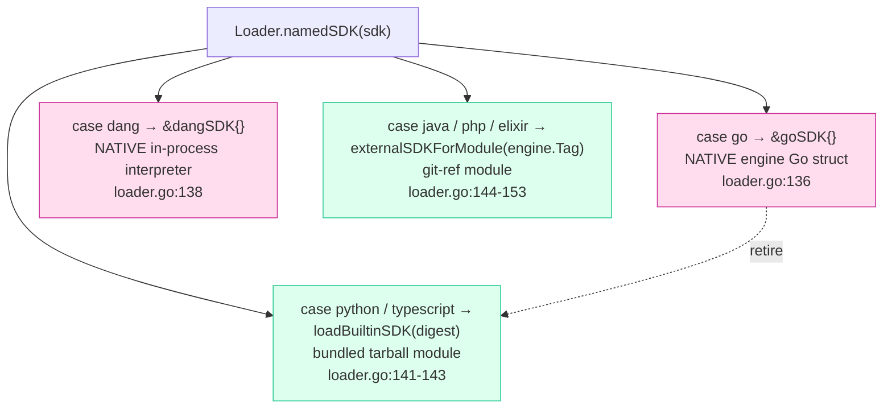
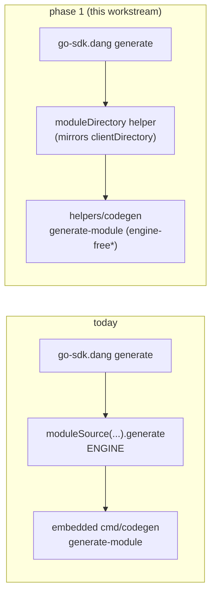
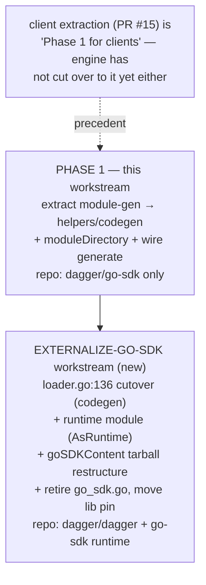

# Externalizing the Go SDK: module codegen & runtime

Investigation + scoping. Written against `dagger/go-sdk@main` (post PR #15) and
`dagger/dagger@main`. Verify `file:line` before acting — both repos move.

## TL;DR

- **Primary task ("bring module codegen into `dagger/go-sdk`") is best read as two
  phases, and the honest answer is "both, in order":**
  - **Phase 1 — `go-sdk`-internal (recommended to do now).** Extract Go *module*
    codegen out of `dagger/dagger:cmd/codegen` into `helpers/codegen`, add a
    `moduleDirectory` dang helper mirroring the existing `clientDirectory`, and
    point `go-sdk.dang`'s `generate` / `mod.dang`'s `generate` at it instead of
    delegating to the engine's `moduleSource(...).generate`. This is the exact
    symmetric completion of PR #15 (which did it for *clients*). It is
    self-contained in `dagger/go-sdk` — no `dagger/dagger` change, no release-
    pipeline risk — and the `[[modules.go-sdk.as-sdk.modules]]` e2e fixtures
    already exist to exercise it.
  - **Phase 2 — engine-side (separate workstream).** Flip `dagger/dagger`'s
    `core/sdk/loader.go` so the builtin `go` SDK resolves to the *external*
    `go-sdk` module instead of the native `goSDK` struct, so the engine uses
    `go-sdk`'s codegen for *every* Go module and `cmd/codegen`'s module path is
    genuinely retired. This is the brief's "broad reading."
- **The brief's "narrow reading" as literally worded is nearly vacuous:**
  `go-sdk` is itself a **dang** module (`dagger.json` `sdk.source = "dang"`,
  `dagger.toml` `generate.skip = ["*"]`), so it generates **no Go module code for
  itself**. Its module-codegen role is entirely about *downstream* modules. So
  "use its own codegen for what it generates for itself" collapses into Phase 1's
  "make `go-sdk`'s `generate` surface do module codegen itself."
- **Side quest ("`go-sdk` also contains the Go module *runtime*") → split it off.**
  It is a `dagger/dagger`-side, release-pipeline-entangled change that *subsumes*
  Phase 2 (same loader switch, plus the `AsRuntime` capability). Recommend a
  dedicated **"externalize the Go SDK"** workstream that carries Phase 2 + the
  runtime together, blocked on Phase 1.

## Current architecture

### Three-tier SDK loading (`core/sdk/loader.go` `namedSDK`)

The engine never branches on SDK name at generation time. It loads an `SDK`, then
narrows it through capability methods on the `SDK` interface
(`core/sdk.go` `AsCodeGenerator` / `AsClientGenerator` / `AsRuntime` / …). Two
families implement those:

- **Native** (`goSDK`, `dangSDK`) — hand-written Go compiled into the engine.
- **Module-backed** (`codeGeneratorModule`, `clientGeneratorModule`, `moduleRuntime`)
  — wrap a loaded Dagger module and forward each capability as a GraphQL field
  selection (`codegen` / `generateClient` / …) against the SDK module. This is how
  Python/TS/PHP/etc. work, and it is the machinery Phase 2 reuses for Go.

So "externalize Go" = stop returning `&goSDK{}` at `loader.go:136` and return a
module-backed SDK (`loadBuiltinSDK` for the Python/TS bundled-tarball model). The
plumbing already exists; only the one `case sdkGo` line and the artifact it points
at change.

### How Go codegen/runtime is provided today (`core/sdk/go_sdk.go`)

Its docstring is explicit:

> goSDK is the one special sdk not implemented as module, instead the
> `cmd/codegen/` binary is packaged into a container w/ the go runtime, tarball'd
> up and included in the engine image.

Mechanism:

- **Build/ship** (`toolchains/engine-dev/build/`): `Builder.CodegenBinary()`
  compiles `./cmd/codegen`; `goSDKContent` (`build/sdk.go`) drops it at
  `/usr/local/bin/codegen` in a `golang:alpine` image with pre-warmed
  `/go/pkg/mod` + `/root/.cache/go-build`, `AsTarball`s it, and stamps the
  manifest digest onto the engine as `DAGGER_GO_SDK_MANIFEST_DIGEST`.
- **Load** (`go_sdk.go` `base`): fetches that image by digest via
  `_builtinContainer(os.Getenv(GoSDKManifestDigestEnvName))` and re-attaches the
  warm caches.
- **Module codegen** (`goSDK.Codegen` → `baseWithCodegen`): `withExec ["codegen",
  "generate-module", --output … --module-source-path … --module-name …
  --introspection-json-path /schema.json --lib-version <goSDKLibVersion>]`, run
  with `experimentalPrivilegedNesting: true` because it dials the engine for the
  self-type schema merge (see below).
- **Client codegen** (`goSDK.GenerateClient`): `withExec ["codegen",
  "generate-client", …]`.
- **Runtime** (`goSDK.Runtime`): `go build`s the user module into `/runtime` and
  sets it as the container entrypoint (`core.ContainerRuntime`).

Two separately-versioned artifacts, easily conflated:

- **(a) codegen+runtime container** — embedded, native (this is what Phase 2 /
  the side quest move).
- **(b) generated client library** `dagger.io/dagger` — *already external*,
  pinned by `goSDKLibVersion` at a commit of the separate `dagger/dagger-go-sdk`
  repo and passed to codegen as `--lib-version`. This pipeline is **orthogonal**
  and survives externalization unchanged.

### `goSDK.GenerateClient` is NOT dead code

A loose end from PR #15 the brief flagged: it is **live**. Because `loader.go:136`
still returns the native `&goSDK{}` for the builtin `go` SDK, `runClientGenerator`
(`core/schema/modulesource.go`) reaches `goSDK.GenerateClient` for `dagger client
install`. `go-sdk`'s own extracted `generateClient` runs on a *different* path —
only when the `go` SDK is referenced as an **external module ref** (via
`clientGeneratorModule`). The two coexist; the extracted one is dormant for the
builtin `go` SDK until Phase 2 flips the loader. So the client extraction is
already "Phase 1 for clients"; the engine has not yet cut over to it either.

## Primary task: module codegen into `go-sdk`

### What's actually missing (the asymmetry PR #15 left)

`go-sdk.dang` already does **client** codegen itself, engine-free:

- `codegenBuilder` builds the `helpers/codegen` binary in a plain `golang` container.
- `clientDirectory` runs it (`codegen --introspection-json-path … --client-meta-path
  … --output …`) — schema + meta in, generated files out, no engine in the loop.
- `generateClient` / `generateAllClient` drive it from `[[…as-sdk.clients]]`.

The **module** path is still engine-delegated: both `go-sdk.dang`'s `generate` and
`mod.dang`'s `generate` bottom out at `polyfill.workspace(ws).moduleSource(rootPath).generate`
— the engine's `ModuleSource.generate`, i.e. the embedded `cmd/codegen generate-module`.
There is **no** `moduleDirectory` helper mirroring `clientDirectory`. Phase 1 adds it.

### Feasibility: can module-gen run engine-free like client-gen? Mostly yes.

Dependency analysis of the not-yet-extracted files ranks them:

| Unit | Difficulty | Note |
|---|---|---|
| `generator/go/mount.go` | **drop** | `MountedFS` is dead code (zero refs); its only engine-internal imports leave with it |
| `generate_entrypoint.go` (both levels) | **trivial** | Go SDK stub returns "not implemented" |
| `generate_module_test.go` | **trivial** | pure `modfile`/`testify` unit test |
| `src/_dagger.gen.go/module.go.tmpl`, `src/internal/dagger/dagger.gen.go.tmpl` | **trivial copy** | into the dest embed FS |
| `generator/go/loader.go` | **easy** | `golang.org/x/tools/go/packages` needs a Go toolchain, not an engine; strip the trace span |
| `generate_library.go` | **easy** | only needs `loader` + module template funcs |
| `templates/module_*.go`, `introspect_emit.go`, `visit.go`, `optional.go` | **mechanical** | pure `go/types` AST; rewrite imports `go`→`gogenerator`; re-widen the `GoTemplateFuncs`/`generateCode` signatures the client extraction narrowed |
| `generator/go/generate_module.go` | **hard (1 feature)** | bootstrap/`go.mod`/tidy is engine-free (swap the `dagger.GoMod`/`GoSum` embed for `go-sdk`'s own); **the self-type schema merge is the one live-engine call** |

Two extraction risks worth naming up front:

1. **Signature re-widening.** To make the client path engine-free, PR #15 *narrowed*
   shared signatures (`GoTemplateFuncs(schema, full, ver, cfg)`, `generateCode(…)`)
   and dropped module-only FuncMap entries (`ModuleMainSrc`, `IsPartial`,
   `Dependencies`, `HasLocalDependencies`). Module-gen needs `ctx/pkg/fset/pass`
   threaded back through and those entries restored — a **modification of already-
   extracted shared files** (`generator.go`, `templates/functions.go`), not a pure
   add. This is where merge conflicts with the client path live.
2. **The self-type schema merge — the one genuine engine dependency.** Cleanly
   factored: an engine-free AST→JSON emit (`ModuleIntrospectionEmitter.ModuleIntrospectionJSON`),
   then one dagql call `Dag.Schema(depsJSON).Merge(moduleTypesJSON, moduleName).Contents()`.
   The Go SDK deliberately no longer implements `moduleTypes`, so this merge is the
   *only* thing that injects the module's own types into the schema the bindings
   are generated from. Three ways to handle it:

   - **(a) Nested engine in the codegen container.** Give the `moduleDirectory`
     helper container `experimentalPrivilegedNesting` and keep the merge inside
     `codegen`, exactly as `go_sdk.go` does today. Faithful lift-and-shift; abandons
     the "engine-free" property the client path won.
   - **(b) Reimplement the merge in pure Go** inside `helpers/codegen`. Keeps the
     helper engine-free but duplicates the engine's `schemaTools` merge semantics —
     a maintenance liability if that logic drifts.
   - **(c) Split at the dang layer (recommended target).** Codegen runs twice, both
     engine-free: pass 1 emits `moduleTypesJSON` from AST; the **dang** layer (which
     runs in-engine natively) does `schema(deps).merge(moduleTypes, name)` via the
     existing dagql tool; pass 2 generates bindings from the merged schema. This
     mirrors how the client path already has the dang layer feed a pre-computed
     schema, and keeps `helpers/codegen` a pure file-in/file-out binary. Open
     question: whether the `schemaTools` merge is reachable from dang/`moduleSource`
     today, or needs a small primitive exposed.

   Pragmatic path: land Phase 1 with **(a)** to get parity fast, then tighten to
   **(c)**; or go straight to **(c)** if the merge primitive is already reachable
   from dang. This is the one design decision inside Phase 1 that needs a call.

Net: ~90% of module-gen ports with mechanical work; the self-merge is a bounded
design choice, not a blocker.

### Recommendation (primary)

Do **Phase 1 now**, in this workstream: extract module-gen into `helpers/codegen`
(mirroring PR #15 and the `gogenerator` naming), add `moduleDirectory`, and wire
`generate` to it. It is the only concrete realization of the "narrow" reading, a
hard prerequisite for the "broad" reading, and carries zero `dagger/dagger` risk.
Treat the self-merge as design decision (c)-over-(a). Defer the engine loader
cutover (Phase 2) to the externalization workstream below.

## Side quest: Go module *runtime* into `go-sdk`

### Is Go's embedding bootstrap-*necessary* (like Dang) or *incidental*?

**Incidental.** Direct comparison:

- **Dang is genuinely bootstrap-bound.** `dangSDK` evaluates module source
  **in-process** via the `vito/dang` interpreter; its runtime is *containerless*
  (`runtime.AsContainer()` → `false`). Loading a Dang module needs a Dang
  interpreter, so the interpreter cannot itself be a Dang module. It ships linked
  into the engine binary with per-major-version freezing. Dang **cannot**
  meaningfully externalize.
- **Go already runs user code out-of-process in a container** (`goSDK.Runtime`
  returns a `core.ContainerRuntime`), exactly like Python/TS. It has none of Dang's
  in-process circularity. The "need Go to build the Go SDK" loop closes at
  *engine-build time* (the engine is Go and already carries the toolchain), not at
  module-load time — the same way Python's runtime module ships pre-built in a
  tarball. Python/TS prove a container-based SDK works fine as a bundled module.

Why Go is native anyway: it's the *original* SDK (predates the bundled-module
mechanism); the engine is itself Go so packaging `cmd/codegen` + warm caches is
nearly free; and the shipped warm `go mod`/`go build` caches make first runs fast.
All convenience/history, none necessity. **The reason that binds Dang does not bind
Go.**

### Blast radius of externalizing the runtime

Mirroring the Python/TS **bundled-tarball** model (keeps offline support; the digest
env var already exists):

1. **New runtime module** — the container orchestration currently in `go_sdk.go`
   (~1000 lines: codegen invocation, `go build`→`/runtime`, entrypoint/workdir,
   GOPRIVATE/gitconfig/SSH injection, cache-volume wiring, VCS ignore paths, client
   gen) must move into module code. In our world that module is **`dagger/go-sdk`
   itself** (already registered as the `go` SDK, `name = "go"`), implementing the
   `AsRuntime` capability alongside the `AsCodeGenerator` Phase 1 adds. **This is the
   bulk of the work.**
2. **`core/sdk/loader.go:136`** — `case sdkGo` from `return &goSDK{}` to the
   bundled/external module load (same shape as Python/TS at :141-143). *Same one-line
   switch Phase 2's broad reading needs* — which is why the two belong together.
3. **`core/sdk/go_sdk.go`** — retire the native struct.
4. **`toolchains/engine-dev/build/sdk.go` `goSDKContent`** — restructure to bundle
   the runtime module source (so `loadBuiltinSDK`'s hardcoded `runtime` subdir
   resolves) while still shipping the codegen binary + warm caches.
5. **`goSDKLibVersion` + `RELEASING.md`** — the lib pin/bump moves out of
   `go_sdk.go`. (The `dagger-go-sdk` *library* publish pipeline is orthogonal and
   stays.)
6. **Self-calls gating** (`AlwaysEnablesSelfCalls`) preserved on the module path.
7. **Tests** — `core/integration` testdata assuming the native Go SDK;
   `workspace_module.go` already maps `go` → `github.com/dagger/go-sdk`, so install-
   name plumbing is partly ready.

What makes Go riskier than Python/TS despite the same mechanism: **the engine and
every in-repo module bootstrap through this SDK**, so a regression on the module
path is higher-blast-radius (the engine dogfoods it). And the warm Go cache is a
Go-specific perf optimization with no Python/TS analog that must be re-plumbed or
first-build latency regresses.

### Relationship to the primary task

- **Phase 2 (broad reading, codegen)** and **the runtime (side quest)** are the
  *same* externalization: one `loader.go:136` switch flips *both* the
  `AsCodeGenerator` and `AsRuntime` capabilities from native to the `go-sdk` module.
  Splitting "codegen" from "runtime" into separate engine cutovers would mean two
  loader flips and a half-native/half-module intermediate state — more work, not
  less. So **fold Phase 2 into the runtime workstream**, not into Phase 1.
- **Both depend on Phase 1**: the engine cannot cut over to `go-sdk`'s codegen/
  runtime until `go-sdk` actually *has* module codegen. Phase 1 is the unblocker.

### Recommendation (side quest)

**Split into a dedicated "externalize the Go SDK" workstream**, scoped to
`dagger/dagger` + this repo's runtime module, carrying **Phase 2 (codegen cutover) +
the runtime** together. Rationale: it's a different repo and blast radius (engine +
release pipeline), it's release-entangled (tarball restructure, digest, lib pin),
and it's blocked on Phase 1 regardless. This matches the CoS's prior read. Keep the
current workstream focused on Phase 1.

## Phasing

## Open design decisions

1. **Self-type schema merge** (Phase 1): (a) nested-engine container, (b) reimplement
   merge in Go, (c) dang-mediated split. Recommend (c), fall back to (a) for parity.
   Needs a check on whether the `schemaTools` merge is reachable from dang today.
2. **`moduleDirectory` shape**: one `generate-module` subcommand on `helpers/codegen`
   vs. the two-pass emit/generate split that (c) implies.
3. **Phase-2 ordering**: cut codegen + runtime over together (single loader flip,
   recommended) vs. codegen-first. Decided in the externalization workstream.
